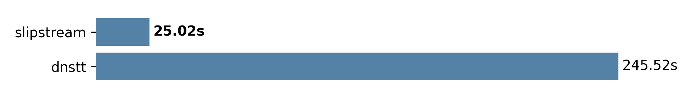

# Slipstream

A high-performance covert channel over DNS, powered by QUIC multipath.

  <picture align="center">
    <source media="(prefers-color-scheme: dark)" srcset="docs/assets/file_transfer_times_dark.png">
    <source media="(prefers-color-scheme: light)" srcset="docs/assets/file_transfer_times_light.png">
    
  </picture>

  <i>Exfiltrating a 10 MB file over a single DNS resolver.</i>

## Highlights

* Adaptive congestion control for rate-limited resolvers
* Parallel routing over multiple multiple rate-limited resolvers
* 60% lower header overhead than DNSTT

## Installation

Get the latest binaries [GitHub releases](https://github.com/EndPositive/slipstream/releases/latest) or pull the latest version from the [GitHub Container Registry](https://github.com/users/EndPositive/packages?repo_name=slipstream).

## Documentation

slipstream's documentation is available at [endpositive.github.io/slipstream](https://endpositive.github.io/slipstream/).

# Acknowledgements

David Fifield's DNSTT and Turbo Tunnel concept has been a massive source of inspiration.
Although slipstream inherits no code, this work could not have been possible without his ideas.
